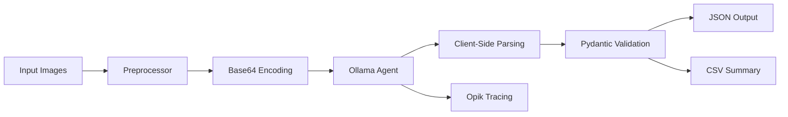

# Medical Lab VLM Pipeline 🏥

[](https://www.python.org/downloads/)
[](https://opensource.org/licenses/MIT)
[](https://python.langchain.com/)
[](https://ollama.com)

A robust, production-grade Python pipeline for extracting structured data from Persian/English medical lab reports using Vision-Language Models (VLMs).

## ✨ Key Features

- **Multimodal Extraction**: Handles both header metadata (Persian/English names, dates, national codes) and complex tabulated test results (Hematology, Hormones, Biochemistry)
- **Prompt-Based Anchoring**: Uses semantic "visual anchors" to accurately locate Persian fields like `کد ملی` (National Code) and `نام بیمار` (Patient Name)
- **Batch Processing**: Multi-threaded processing optimized for local GPUs with configurable batch sizes
- **Resilient Architecture**:
  - **Client-Side Parsing**: Bypasses server-side JSON limitations in smaller VLMs by handling parsing in Python
  - **Context Flushing**: Fixes common Ollama KV-cache corruption bugs during batch processing
- **Full Observability**: Integrated with **Opik (by Comet)** for tracking traces, latency, inputs/outputs, and validation errors

## 🛠️ Tech Stack

| Category | Technologies |
|----------|-------------|
| **Core** | Python 3.11+, Pydantic V2 |
| **AI Engine** | Ollama (DeepSeek-OCR / LLaVA 3.2 Vision) |
| **Orchestration** | LangChain, LCEL |
| **Observability** | Opik (Comet ML) |
| **Image Processing** | Pillow |
| **HTTP Client** | HTTPX |
| **Concurrency** | ThreadPoolExecutor |

## 📂 Project Structure

```
medical-lab-vlm/
├── data/
│   ├── images/              # Input medical reports (.jpg, .png)
│   └── prompts.json         # Configurable prompts for different extraction strategies
├── outputs/
│   ├── logs/                # Execution logs (per run)
│   ├── results/             # Structured JSON outputs per prompt ID
│   └── summary_report.csv   # Batch processing statistics
├── src/
│   ├── agent_factory.py     # Ollama client with timeouts & client-side parsing
│   ├── pipeline.py          # Main batch orchestrator & thread pool
│   ├── preprocessor.py      # Image resizing, enhancement & base64 conversion
│   ├── logger.py            # Thread-safe logging setup
│   └── schemas.py           # Pydantic models for data validation
├── utils/                   # Helper utilities
├── config.yaml              # Global configuration (model, timeouts, paths)
├── main.py                  # Entry point
├── .env                     # Environment variables (Opik keys)
└── requirements.txt         # Python dependencies
```

## 🚀 Quick Start

### Prerequisites

- **Python 3.11 or higher**
- **Ollama** installed ([download here](https://ollama.com))
- **At least 8GB RAM** (16GB recommended for larger batches)
- **GPU** (optional but recommended for faster inference)

### Installation

1. **Clone the repository**
   ```bash
   git clone https://github.com/davardoust/medical-lab-vlm.git
   cd medical-lab-vlm
   ```

2. **Create and activate virtual environment**
   ```bash
   python -m venv venv
   source venv/bin/activate  # On Windows: venv\Scripts\activate
   ```

3. **Install dependencies**
   ```bash
   pip install -r requirements.txt
   ```

4. **Install and serve Ollama**
   ```bash
   # Pull the vision model (choose one)
   ollama pull deepseek-ocr
   # OR
   ollama pull llama3.2-vision
   
   # Start the Ollama server (in a separate terminal)
   ollama serve
   ```

5. **Configure environment (optional)**
   ```bash
   cp .env.example .env
   # Edit .env with your Opik API key if using cloud observability
   ```

## ⚙️ Configuration

### `config.yaml`

Control global pipeline settings:

```yaml
system:
  input_dir: "./data/images"
  output_dir: "./outputs"
  prompts_file: "./data/prompts.json"
  batch_size: 1               # Keep to 1-2 for local GPUs
  log_level: "INFO"

model:
  name: "deepseek-ocr"        # or "llama3.2-vision"
  timeout: 300                # Seconds per request
  base_url: "http://localhost:11434"
```

### `data/prompts.json`

Define extraction strategies with visual anchors:

```json
{
  "header_extraction": {
    "prompt": "Extract patient name, national code, and test date from this lab report...",
    "visual_anchors": ["کد ملی", "نام بیمار", "تاریخ"]
  },
  "hematology_panel": {
    "prompt": "Extract CBC results including WBC, RBC, Hemoglobin...",
    "visual_anchors": ["WBC", "RBC", "HGB", "PLT"]
  }
}
```

### Environment Variables (`.env`)

```env
# Opik Observability (optional)
OPIK_API_KEY=your_key_here
OPIK_WORKSPACE=default
OPIK_PROJECT_NAME=medical-ocr-extraction

# For self-hosted Opik
# OPIK_URL_OVERRIDE=http://localhost:5173/api
```

## 🏃 Usage

### Basic Execution

```bash
python main.py
```

The pipeline will:
1. Load all images from `data/images/`
2. Preprocess images (resize, convert to base64)
3. Process each image through Ollama using defined prompts
4. Validate outputs against Pydantic schemas
5. Save individual JSON results to `outputs/results/<prompt_id>/`
6. Generate a summary CSV at `outputs/summary_report.csv`

### Advanced Usage

**Process specific images only:**
```python
# Modify main.py or create custom script
from src.pipeline import BatchProcessor

processor = BatchProcessor(config_path="config.yaml")
processor.process_subset(["image1.jpg", "image2.jpg"])
```

**Custom prompts at runtime:**
```python
from src.agent_factory import OllamaAgent

agent = OllamaAgent(model_name="deepseek-ocr")
result = agent.extract_from_image(
    image_path="path/to/report.jpg",
    custom_prompt="Extract only the liver function tests..."
)
```

## 📊 Observability with Opik

This project uses **Opik** for comprehensive execution tracing.

### Local Opik (Docker)
```bash
docker run -d --name opik -p 5173:5173 cometopik/opik:latest
# Access dashboard at http://localhost:5173
```

### Cloud Opik
1. Sign up at [Comet Opik](https://www.comet.com/opik)
2. Get your API key
3. Add to `.env` file

**What you can monitor:**
- Complete prompt templates sent to LLM
- Raw JSON responses before parsing
- Validation errors with field-level details
- Latency metrics per image (preprocessing → inference → validation)
- Batch processing statistics

## 🐛 Troubleshooting

| Error | Solution |
|-------|----------|
| `Status Code 500` from Ollama | Restart Ollama: `ollama serve`. KV cache may be corrupted. |
| `SameBatch may not be specified...` | Update `src/agent_factory.py` to set `num_keep=0` in model config. |
| `Validation Error` | Check `src/schemas.py`. Ensure field types match model's output capability. |
| `ConnectionRefused` | Verify Ollama is running: `curl http://localhost:11434/api/tags` |
| Out of memory errors | Reduce `batch_size: 1` in `config.yaml` and restart |
| Persian text not recognized | Ensure your model supports multilingual OCR (DeepSeek-OCR works well) |

## 📈 Performance Tips

1. **Batch Size**: Keep `batch_size: 1` for Vision models (they're memory-intensive)
2. **Image Preprocessing**: Resize large images to max 1024x1024 pixels
3. **Model Selection**:
   - `deepseek-ocr`: Better for Persian/English mixed text
   - `llama3.2-vision`: Faster but may struggle with Persian
4. **GPU Acceleration**: Set `OLLAMA_GPU_OVERHEAD=0` environment variable
5. **Caching**: Enable prompt caching in Ollama for repeated similar images

## 🔄 Pipeline Workflow



## 📝 Example Output

### JSON Result (`outputs/results/header_extraction/report_001.json`)
```json
{
  "patient_name": "احمد رضایی",
  "national_code": "1234567890",
  "test_date": "1402/12/15",
  "lab_name": "آزمایشگاه پاتوبیولوژی نور",
  "tests": [
    {"name": "WBC", "value": "7.5", "unit": "×10³/µL", "reference_range": "4.0-10.0"},
    {"name": "Hemoglobin", "value": "14.2", "unit": "g/dL", "reference_range": "13.5-17.5"}
  ]
}
```

### Summary CSV (`outputs/summary_report.csv`)
| filename | prompt_id | success | latency_sec | validation_errors |
|----------|-----------|---------|-------------|-------------------|
| report_001.jpg | header_extraction | True | 3.45 | 0 |
| report_001.jpg | hematology_panel | True | 4.21 | 0 |
| report_002.jpg | header_extraction | False | 2.98 | 1 |

## 🤝 Contributing

Contributions are welcome! Please follow these steps:

1. Fork the repository
2. Create a feature branch (`git checkout -b feature/amazing-feature`)
3. Commit your changes (`git commit -m 'Add amazing feature'`)
4. Push to the branch (`git push origin feature/amazing-feature`)
5. Open a Pull Request

## 📄 License

Distributed under the MIT License. See `LICENSE` for more information.

## 🙏 Acknowledgments

- [Ollama](https://ollama.com) - Local LLM inference
- [LangChain](https://python.langchain.com) - LLM orchestration framework
- [Opik](https://www.comet.com/opik) - Observability and tracing
- [DeepSeek](https://deepseek.com) - Vision-language model

## 📧 Contact

Project Maintainer - [@davardoust](https://github.com/davardoust)

Project Link: [https://github.com/davardoust/medical-lab-vlm](https://github.com/davardoust/medical-lab-vlm)

---

**⭐ Star this repository if you find it useful for your medical imaging projects!**
